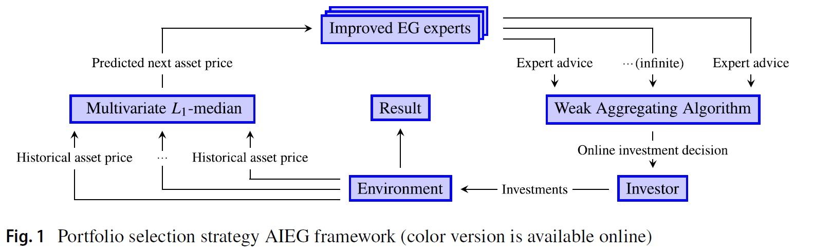

# AIEG
Yong Zhang, Jiahao Li, Xingyu Yang, and Jianliang Zhang. "Competitive online strategy based on improved exponential gradient expert and aggregating method" Computational Economics, 2023.



## About
In recent years, online portfolio selection (OLPS) has received more and more attention from quantitative investment and artificial intelligence communities. This paper first improves a classic OLPS strategy Exponential Gradient (EG) (Helmbold in MF 8:325–347, 1998) by fully exploiting multi-period price information via the L1-median estimator, and further designs a novel strategy named Aggregating Improved Exponential Gradient (AIEG) by using Weak Aggregating Algorithm (WAA) to aggregate an infinite number of Improved EG (IEG) expert advice. The universality of the proposed strategy is proved. This paper empirically evaluates the proposed strategy through a wide range of experiments. Promising empirical results verify that the proposed AIEG strategy performs well in terms of different aspects and can resist reasonable transaction costs.

## Risk Disclaimer (for Live-trading)
There is always risk of loss in trading. **All trading strategies are used at your own risk**

## Contribution

### Contributors
* ***Yong Zhang***
* ***Jiahao Li (contact: jiahaoli57@163.com)***
* ***Xingyu Yang***
* ***Jianliang Zhang***

### Institution
* ***School of Management, Guangdong University of Technology***

### Acknowledgement
This project would not have been finished without using the codes from the following open source projects:

* [Online Portfolio Selection toolbox](https://github.com/OLPS/OLPS)

### Community Contribution
We welcome contributions from the community, including but not limited to:
* Bug fixing

## Citations
Please consider citing our work if you find our code/paper is useful to your work.
```bibtex
@article{zhang2023competitive,
	title     = {Competitive online strategy based on improved exponential gradient expert and aggregating method},
	author    = {Zhang, Yong and Li, Jiahao and Yang, Xingyu and Zhang, Jianliang},
	journal   = {Computational Economics},
        pages     = {1--26},
	doi       = {10.1007/s10614-023-10430-2},
	year      = {2023},
	publisher = {Springer}
}
```
